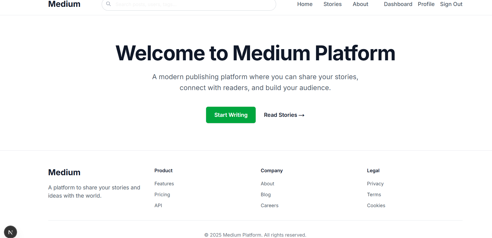
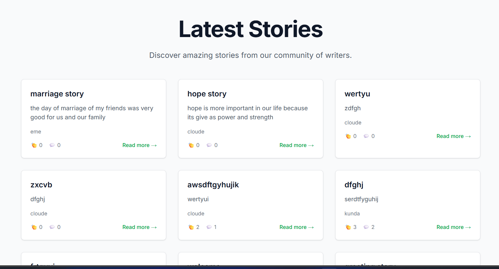
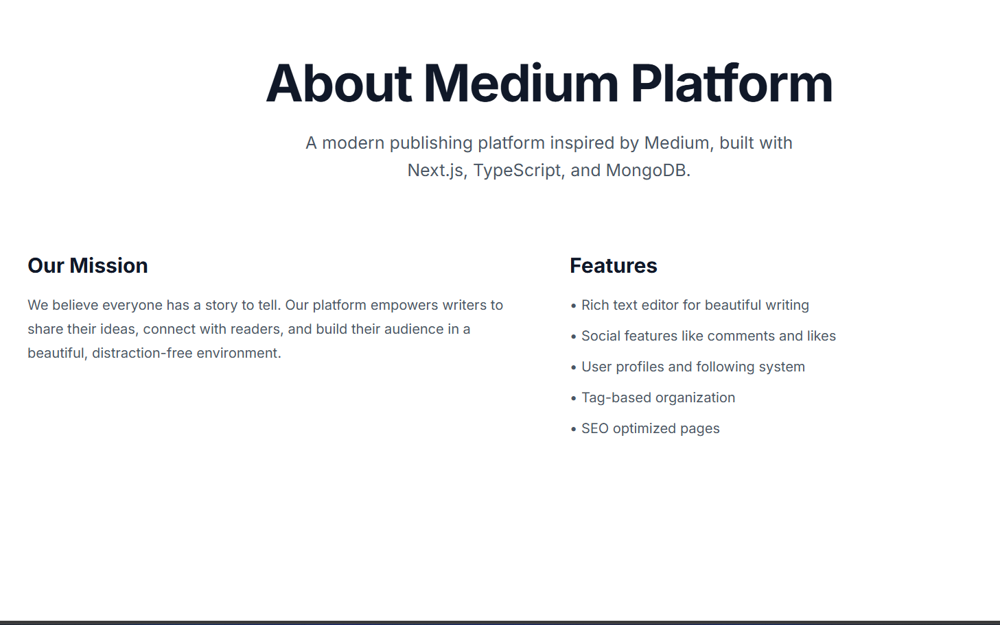
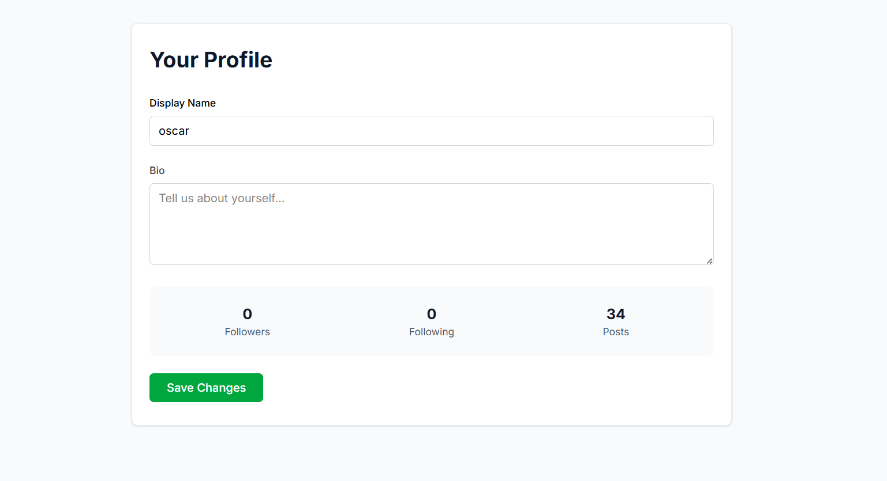
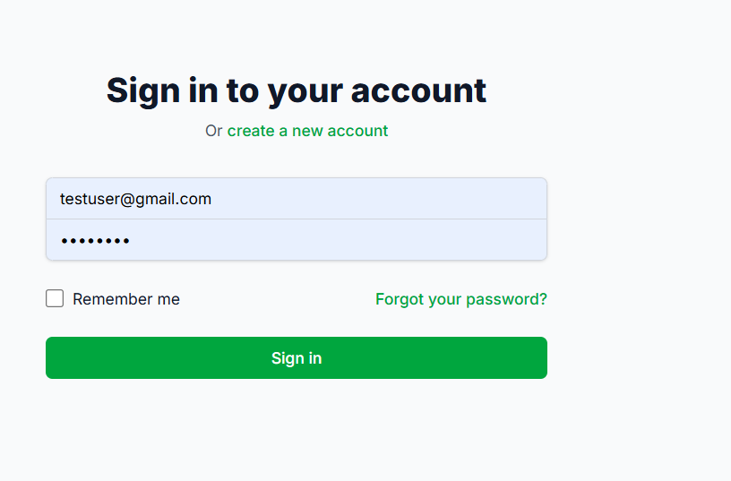

# Medium Platform

A modern, full-stack blogging platform inspired by Medium, built with Next.js 16, TypeScript, MongoDB, and NextAuth.js.

# Features

- Authentication: Secure user registration and login with NextAuth.js
- Content Management: Rich text editor for creating and editing posts
- Social Features: Follow users, like posts, and comment on articles
- User Profiles: Customizable profiles with bio and follower/following counts
- Responsive Design: Mobile-first design with Tailwind CSS
- SEO Optimized: Server-side rendering and meta tags
- Image Upload: Support for post cover images and user avatars
- Search & Discovery: Browse posts by tags and search functionality

# Tech Stack

- Frontend: Next.js 16, React 19, TypeScript
- Styling: Tailwind CSS
- Database: MongoDB with Mongoose
- Authentication: NextAuth.js with JWT
- State Management: TanStack React Query
- Rich Text Editor: TipTap

# Prerequisites

- Node.js 18+ 
- MongoDB database (local or MongoDB Atlas)
- Git

# 1. Install Dependencies

`bash
npm install
`

# 2. Environment Configuration

Create a `.env.local` file in the root directory:

# 3. Database Setup

# Option A: Local MongoDB
1. Install MongoDB locally
2. Start MongoDB service
# 📁 Project Structure
src/
├── app/                    # Next.js App Router pages
│   ├── api/               # API routes
│   ├── auth/              # Authentication pages
│   ├── posts/             # Post-related pages
│   ├── profile/           # User profile pages
│   └── dashboard/         # User dashboard
├── components/            # Reusable React components
│   ├── auth/              # Authentication components
│   ├── shared/            # Shared UI components
│   └── layout/            # Layout components
├── hooks/                 # Custom React hooks
├── lib/                   # Utility libraries
│   ├── api/               # API client functions
│   ├── auth/              # Authentication configuration
│   ├── db/                # Database connection
│   ├── models/            # Mongoose models
│   └── services/          # Business logic services
├── types/                 # TypeScript type definitions
└── providers/             # React context providers

# Key Components

# Authentication System
- NextAuth.js with JWT strategy
- Credential-based login with bcrypt password hashing
- Protected routes with middleware
- Session management across the application

# Database Models
- User: Profile information, authentication data
- Post: Blog posts with content, metadata, and relationships
- Comment: Nested comments on posts
- Like: User likes on posts
- Follow: User following relationships
- Tag: Post categorization

# API Architecture
- RESTful API design with Next.js API routes
- Error handling with custom ApiError class
-  middleware for protected endpoints
- Data validationand sanitization
1. Push to GitHub:
   `bash
   git add .
   git commit -m "Initial commit"
   git push origin main
#Creating Your First Post
1. Sign up for an account
2. Navigate to Dashboard
3. Click "Write a Story"
4. Use the rich text editor to create content
5. Add tags and publish
# Available Scripts
- `npm run dev` - Start development server
- `npm run build` - Build for production
- `npm run start` - Start production server
- `npm run lint` - Run ESLint
# Contributing

1. Fork the repository
2. Create feature branch (`git checkout -b feature/amazing-feature`)
3. Commit changes (`git commit -m 'Add amazing feature'`)
4. Push to branch (`git push origin feature/amazing-feature`)
5. Open Pull Request

# Acknowledgments

- Next.js - React framework
- Tailwind CSS - CSS framework
- NextAuth.js- Authentication
- MongoDB- Database
image of home page 
image of post page 
iamage of about page 
image of Dashboard page 
 image of profile page 
 

